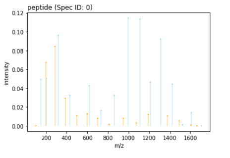

#  Spectral Library prediction at Mass Dynamics

This repository contains code to convert the Mass Dynamics Peptide Mapping workflow search results into the correct input format required to run [`ms2Pip`](https://github.com/compomics/ms2pip_c#peprec-file)


## Environment setup

```bash
./scripts/prepare.sh
```

```bash
conda activate speclib
```

## Get predictions using MS2pip and Mass Dynamics search results as input

**Prepare ms2pip input from Mass Dynamics search results**

```bash
python md_spectral_prediction/main.py --search_results_path test_data/searchResult_subset.json --output_directory output_data
```

**Run ms2pip**

```bash
ms2pip -c ./test_data/config.txt ./output_data/search.peprec
```

**Merge predictions with initial search results**

```python
preciction = pd.read_csv("test_data/searchResults_subset.csv")
peprec_input = pd.read_csv("output_data/search.peprec", sep="\t")
preciction1 = preciction.merge(peprec_input, how='left')
preciction1.to_csv(os.path.join("output_data", 'final_predictions.csv'))
```


## Plot predictions



